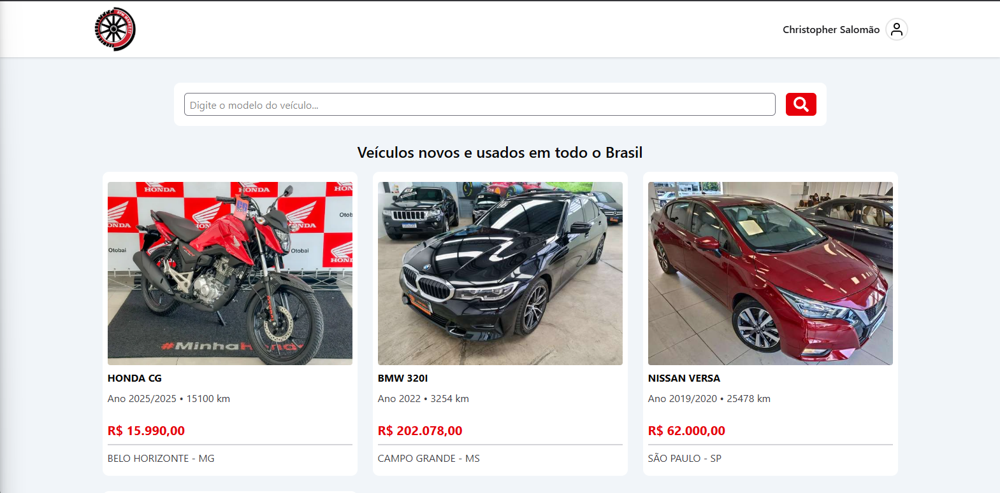

# 🚗 RPM Market

Um marketplace fictício de compra e venda de veículos, desenvolvido como parte de um curso.
Além das funcionalidades originais, o projeto recebeu algumas melhorias visuais e de experiência do usuário.

## 🛠 Tecnologias Utilizadas

- **[Vite](https://vitejs.dev/)** – Build tool rápida para desenvolvimento moderno
- **[React](https://react.dev/)** – Biblioteca para construção da interface
- **[TypeScript](https://www.typescriptlang.org/)** – Tipagem estática para mais segurança no código
- **[Firebase](https://firebase.google.com/)** – Autenticação e banco de dados em tempo real
- **[Tailwind CSS](https://tailwindcss.com/)** – Estilização rápida e responsiva
- **[shadcn/ui](https://ui.shadcn.com/)** – Componentes acessíveis e estilizados

## ✨ Diferenças em relação ao projeto original

- **Identidade visual aprimorada** – ajustes na interface para um layout mais limpo e atrativo
- **Nome e logo próprios** – agora chamado **RPM Market**, com identidade visual personalizada
- **Confirmação de ações importantes** – uso do `Dialog` do shadcn/ui para confirmar logout ou exclusão de conta
- **Mensagem de erro personalizada** – alerta amigável quando o usuário tenta buscar um veículo que não está à venda

## 📸 Preview



## 🚀 Como executar

1. **Clone o repositório:**
   ```bash
   git clone https://github.com/christopher-salomao/rpm-market.git
